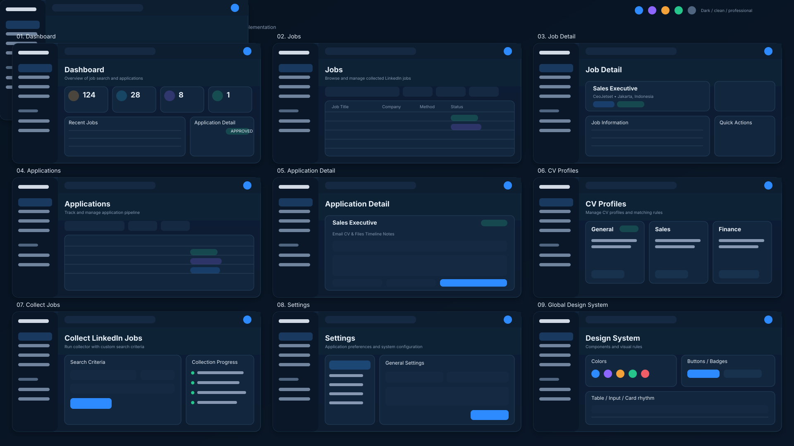
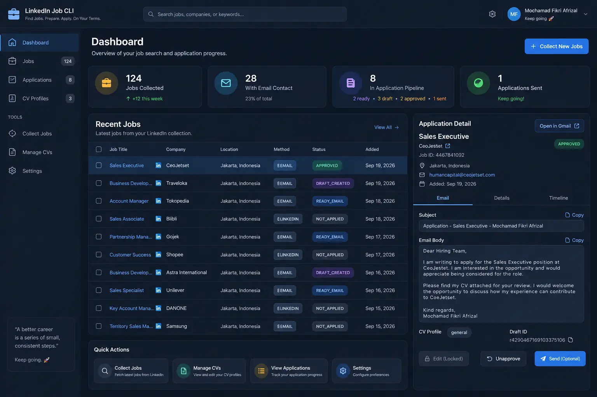

# UI Reference Suite

This document defines the canonical visual system for the local LinkedIn Job CLI web application.

## Master reference



The master board defines the **shared application shell and page family**. All pages must feel like one product: same sidebar, top navigation, spacing scale, surface colors, typography, controls, table density, badges, cards, and action hierarchy.

## Detailed Dashboard reference



The Dashboard WebP remains the detailed **1:1 desktop fidelity reference** at 1536×1024. Use it for exact proportions, visual density, border treatment, shadows, panel spacing, and the Application Detail rail.

## Canonical page set

The UI implementation should contain these screens in this order:

1. **Dashboard**
   - KPI cards: Jobs Collected, With Email Contact, Application Pipeline, Applications Sent.
   - Recent Jobs table.
   - Selected Application Detail panel.
   - Quick Actions.
   - Primary action: Collect New Jobs.

2. **Jobs**
   - Search and filter toolbar.
   - Full collected-jobs table.
   - Filters for location, method, status, date, and other existing collector metadata.
   - Row selection opens or navigates to Job Detail.
   - Pagination uses the same density as the Dashboard table.

3. **Job Detail**
   - Job title, company, location, posted date, application method, LinkedIn job id.
   - Tabs/sections for Overview, Description, Company, Application, and Notes where supported by existing data.
   - External LinkedIn action.
   - Application quick action only when supported by current workflow.

4. **Applications**
   - Application queue table.
   - Lifecycle filters for `READY_EMAIL`, `DRAFT_CREATED`, `APPROVED`, and `SENT`.
   - Search/filter by company, method, state, and date.
   - Selecting a record opens Application Detail.

5. **Application Detail**
   - Recipient, subject, email body, CV profile, Gmail draft id, review state, and provider metadata.
   - Tabs/sections for Email, CV & Files, Timeline, and Notes only where backed by real data.
   - Actions map directly to the existing lifecycle.
   - `Send (Optional)` remains explicit and manual.

6. **CV Profiles**
   - This is the single file-management page; do not add a separate Documents navigation item.
   - Upload or replace CV files directly from the browser.
   - Cards for configured CV profiles such as General, Sales, Finance, or future profiles.
   - Default profile indicator plus editable matching keywords and priority.
   - Additional Attachments section for portfolio, cover letter, certificates, and other supporting files.
   - Additional files are selected manually per application before creating the Gmail draft.

7. **Collect Jobs**
   - Search criteria form.
   - Keyword/title query.
   - Location.
   - Posted-within window.
   - Bounded collection options.
   - Start Collection primary action.
   - Collection progress/log panel.
   - Results should flow into the existing SQLite collector store.

8. **Settings**
   - General candidate/application preferences.
   - Collector configuration.
   - Email/Gmail bridge configuration where applicable.
   - CV defaults.
   - Database/runtime information.
   - Appearance/about sections may be present, but avoid fake settings that are not implemented.

## Global navigation

Use one persistent application shell:

```text
LinkedIn Job CLI

Dashboard
Jobs
Applications
CV Profiles

TOOLS
Collect Jobs
Settings
```

The active item uses the blue selected state shown in the references. The topbar remains persistent and contains global search, utility/settings access, and the local user identity treatment.

## Design system

### Visual language

- Dark navy application background.
- Slightly lighter elevated panels.
- Thin blue-gray borders.
- Restrained shadows.
- One primary blue accent.
- Semantic green, purple, amber, red, and neutral gray status colors.
- Rounded corners, but not oversized/pill-heavy.
- Dense professional table layouts.
- Clear hierarchy between page title, card title, body, and metadata.
- No decorative gradients or illustrations that break the command-center aesthetic.

### Core color direction

- App background: approximately `#071321` / `#0A1728`.
- Elevated panel: approximately `#102238`.
- Card/input surface: approximately `#12263D` / `#152A42`.
- Border: approximately `#223A55` / `#29435E`.
- Primary blue: approximately `#2E8BFF`.
- Success: approximately `#25C58B`.
- Draft/purple: approximately `#8D66FF`.
- Warning: approximately `#F3A23A`.
- Danger: approximately `#EF5D67`.
- Primary text: approximately `#E8F0FA`.
- Secondary text: approximately `#8799B2`.

These values are visual reference tokens, not a requirement to hard-code duplicate values throughout the codebase. Centralize them in the UI stylesheet.

### Shared component rules

The same component variants must be reused across pages:

- primary / secondary / ghost / danger buttons;
- text inputs and search inputs;
- select/filter controls;
- cards and elevated panels;
- data table header and row styles;
- pagination;
- status badges;
- detail metadata rows;
- tabs;
- empty, loading, and error states.

Do not redesign a component independently per page.

## Functional mapping

The visual design must be backed by the existing repository workflow rather than mock-only data:

- **Jobs Collected** → collector / SQLite jobs.
- **With Email Contact** → explicit extracted application emails.
- **Application Pipeline** → `applications` lifecycle.
- **Application Detail** → selected job + application record.
- **CV Profile** → configured deterministic CV profile.
- **Open in Gmail** → persisted Gmail draft when available.
- **Collect Jobs** → existing collector workflow.
- **Applications** → `READY_EMAIL`, `DRAFT_CREATED`, `APPROVED`, and `SENT`.

## Safety / product constraints

- `Send (Optional)` remains an explicit, manual action.
- Never auto-send email.
- Never auto-apply on LinkedIn.
- Never auto-DM or auto-connect.
- Follow-up tracking is intentionally out of scope.
- Do not expose actions in the UI that bypass lifecycle guards already implemented in the backend.

## Fidelity rules

- **Dashboard:** match `job-command-center.webp` as closely as practical at the 1536×1024 reference viewport.
- **Other pages:** derive from the master board while preserving the exact Dashboard design language.
- Sidebar width, topbar height, content gutters, card radius, table row height, and typography should remain consistent across pages.
- Responsive behavior may reflow panels on smaller screens, but desktop is the primary reference.
- Real application state must replace mock labels/content during implementation.

## Implementation status

### Phase 1 — complete

The repository now contains the first implementation of the complete page family under the existing `serve` command:

- `/app/dashboard`
- `/app/jobs`
- `/app/jobs/<job_id>`
- `/app/applications`
- `/app/applications/<job_id>`
- `/app/cv-profiles`
- `/app/collect`
- `/app/settings`

Dashboard, Jobs, Applications, CV Profiles, and Settings are populated from the existing SQLite/config data. Application send/review buttons and collector execution remain intentionally disabled in this UI phase until their POST endpoints are wired to the already-tested lifecycle guards.

The former server-rendered jobs browser is retained at `/legacy` during migration so existing filtering/status/delete regression coverage is not discarded.

## Phase 3 — Functional wiring

### Collect Jobs — live validated

The Collect Jobs page now submits to a real CSRF-protected backend endpoint:

```text
POST /app/collect/run
```

The web action and CLI both use the same shared collector runner. The browser workflow is intentionally bounded:

- anonymous public LinkedIn collection only;
- keywords are required;
- maximum 100 results per web run;
- posted-within is validated through the existing collector parser;
- existing LinkedIn job IDs are skipped;
- structural dedup remains active;
- full detail/application extraction still runs;
- results are persisted to the existing SQLite store;
- session fallback and force-overwrite remain CLI-only;
- duplicate submissions are serialized by the local web server.

After completion, the page reports searched, new-candidate, persisted, exact-duplicate, and likely-repost counts.

This stage has been live-validated in the user's local browser and persists collected jobs into the existing SQLite-backed UI.

### Queue Application — live validated

Job Detail now exposes a real CSRF-protected `Queue Application` action:

```text
POST /app/jobs/<job_id>/queue
```

It delegates to the existing `Store.QueueApplication` lifecycle logic:

- explicit EMAIL + extracted recipient → `READY_EMAIL`;
- otherwise → `NEED_REVIEW`;
- existing `DRAFT_CREATED`, `APPROVED`, and `SENT` states remain protected by the store;
- no prepare, draft creation, approval, or send happens automatically.

After queueing, the UI redirects to Application Detail for the queued job. Job Detail changes from `Queue Application` to `View Application` once a lifecycle record exists.

`NEED_REVIEW` is now surfaced in application filters, pipeline counts, and status badges. The queue action has been live-validated in the user's local browser with both READY_EMAIL and NEED_REVIEW records visible in the application pipeline.

### Prepare Application — live validated

Application Detail now exposes a real preparation action for `READY_EMAIL` records:

```text
POST /app/applications/<job_id>/prepare
```

It delegates to the existing deterministic Application Engine:

- only `READY_EMAIL` is accepted by the web action;
- optional CV profile override can be selected from configured profiles;
- leaving the selector on Auto uses existing keyword scoring/default fallback;
- subject and email body are generated by the same `application.Prepare` logic as the CLI;
- preparation persists subject, body, and CV profile through `SaveApplicationPreparation`;
- lifecycle state remains `READY_EMAIL`;
- no Gmail draft is created;
- no email is sent;
- `NEED_REVIEW` records are blocked until recipient/contact data is resolved.

Re-preparation remains available while a record is still `READY_EMAIL`. Once it reaches `DRAFT_CREATED`, `APPROVED`, or `SENT`, existing backend lifecycle guards prevent silent re-preparation. The prepare action has been live-validated in the user's local browser.

### CV Profiles file management — live validated

File management stays inside `/app/cv-profiles`; there is no separate Documents page.

Implemented actions:

```text
POST /app/cv-profiles/upload
POST /app/cv-profiles/<id>/update
POST /app/cv-profiles/<id>/default
POST /app/cv-profiles/<id>/delete
POST /app/cv-profiles/attachments/upload
POST /app/cv-profiles/attachments/<id>/delete
```

Uploaded CVs and supporting files are stored under the local `~/.linkedin-jobs/files/` directory. Application Detail exposes configured supporting files as optional checkboxes and includes only the selected files when creating the Gmail draft.

CV upload/replace, additional supporting-file upload, the per-application optional attachment picker, and Gmail draft creation with selected optional attachments have all been live-validated in the user's local browser.

### Native Gmail OAuth + Draft Creation — live validated

The local web application now supports native Gmail OAuth and draft creation without depending on the ChatGPT Gmail connector.

Routes:

```text
POST /app/gmail/connect
GET  /app/gmail/oauth/callback
POST /app/gmail/disconnect
POST /app/applications/<job_id>/draft
```

Implementation boundaries:

- OAuth Desktop/loopback flow with PKCE and state;
- minimum Gmail scope: `gmail.compose`;
- credentials default to `~/.linkedin-jobs/gmail-credentials.json`;
- tokens default to `~/.linkedin-jobs/gmail-token.json` and are forced to `0600`;
- access tokens are refreshed using the stored refresh token;
- Gmail draft content is RFC/MIME with the configured CV attached;
- Gmail API `drafts.create` is called only from an explicit user action;
- successful Gmail draft IDs are persisted through `MarkApplicationDraftCreated`;
- state advances from `READY_EMAIL` to `DRAFT_CREATED`;
- no send occurs;
- the UI blocks draft creation if the selected CV file is missing;
- Gmail OAuth is restricted to a local loopback host.

Gmail OAuth connection and native Gmail draft creation have been live-validated in the user's local browser. Multi-attachment Gmail draft creation has also been live-validated with a CV plus portfolio attachment.

See `docs/GMAIL_SETUP.md` for setup instructions.

## Reference assets

- Detailed Dashboard: `docs/ui-reference/job-command-center.webp`
- Full application master board: `docs/ui-reference/full-application-ui-reference.svg`

Treat this suite as the source of truth for future UI implementation unless the user explicitly approves a visual change.
